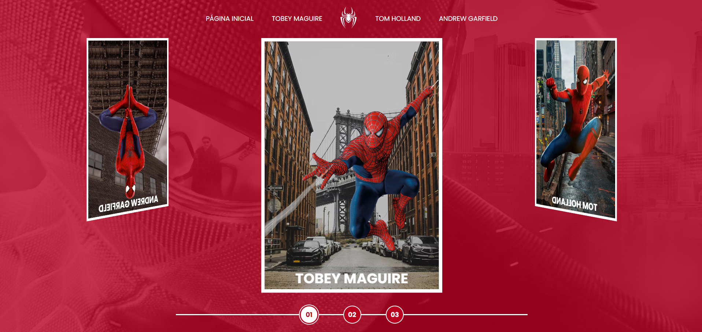
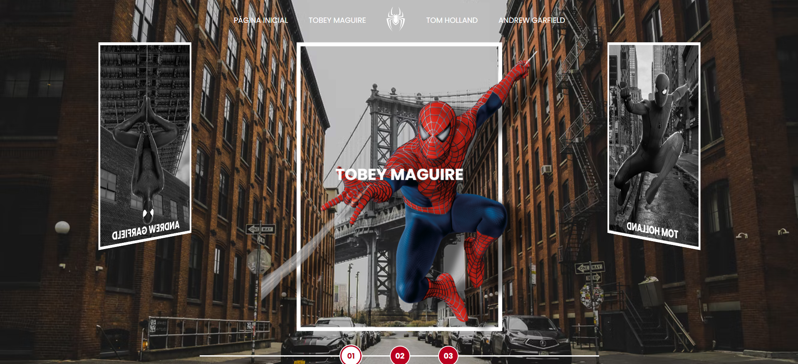

# Multiverso Spider-Man - Projeto DIO

Bem-vindo ao projeto **Multiverso Spider-Man**, desenvolvido durante o curso de JavaScript na Digital Innovation One (DIO). Este projeto teve como objetivo aplicar e aprofundar diversos conceitos de JavaScript, HTML e CSS, através da criação de um efeito visual 3D em um carrossel com imagens do Homem-Aranha.

## Visão Geral

O projeto Multiverso Spider-Man é uma aplicação web que apresenta um carrossel 3D com imagens do Homem-Aranha, oferecendo uma experiência visual única e interativa. Além do carrossel, a aplicação exibe vídeos de fundo quando se entra para ver as sinopses dos filmes, proporcionando um ambiente imersivo e dinâmico. Este projeto foi desenvolvido exclusivamente para desktop.

## Funcionalidades

- **Carrossel 3D**: Efeito visual 3D que permite navegar entre diferentes imagens do Homem-Aranha.
- **Vídeos de Fundo**: Exibição de vídeos como plano de fundo ao acessar as sinopses dos filmes, criando uma experiência envolvente.
- **Efeito Hover**: Ao passar o mouse sobre as imagens do Homem-Aranha, a imagem cresce e o background muda através de manipulação do DOM com JavaScript, proporcionando uma interação visual dinâmica.
- **Manipulação de Elementos**: Uso de JavaScript para adicionar, remover e modificar elementos do DOM, bem como para controlar a rotação do carrossel.
- **Inspeção e Debugging**: Utilização das ferramentas de desenvolvedor para inspecionar elementos e entender o impacto das alterações no CSS e JS em tempo real.

## Tecnologias Utilizadas

### HTML

O HTML foi utilizado para estruturar os elementos do carrossel, os vídeos de fundo e o conteúdo da aplicação, criando uma base sólida para a interação com CSS e JavaScript.

### CSS

O CSS foi fundamental para criar o efeito visual 3D do carrossel e estilizar a aplicação. Foram aplicados diversos estilos e transformações CSS para alcançar a aparência desejada, incluindo:

- **Transformações 3D**: Uso de `transform`, `rotate`, e `translate` para posicionar e animar os elementos em um espaço tridimensional.
- **Estilização de Vídeos de Fundo**: Ajustes de estilo para incorporar vídeos como plano de fundo sem comprometer a usabilidade.

### JavaScript

O JavaScript foi usado para manipular os elementos do DOM e implementar a lógica do carrossel e do efeito hover. Alguns dos conceitos avançados de JavaScript trabalhados incluem:

- **Manipulação do DOM**: Adição e remoção dinâmica de elementos HTML, bem como atualização de estilos e classes CSS.
- **Eventos e Interatividade**: Uso de event listeners para capturar e responder a interações do usuário, como cliques e movimentos.
- **Efeito Hover com JS**: Implementação de lógica JavaScript para aumentar a imagem do Homem-Aranha e mudar o background ao passar o mouse sobre ela.
- **Debugging e Inspeção**: Utilização das ferramentas de desenvolvedor do navegador para inspecionar elementos, visualizar logs no console e depurar código JavaScript.

## Como Executar o Projeto

1. **Clone o repositório**: Clone este repositório para sua máquina local usando `git clone`.

2. **Abra o projeto**: Navegue até o diretório do projeto e abra o arquivo `index.html` em seu navegador preferido.

3. **Explore o Carrossel 3D**: A aplicação irá carregar o carrossel 3D automaticamente ao ser aberta. Use as setas de navegação para explorar as diferentes imagens do Homem-Aranha.

4. **Assista os Vídeos de Fundo**: Ao acessar as sinopses dos filmes, vídeos de fundo serão carregados automaticamente, proporcionando uma experiência visual imersiva.

5. **Interaja com o Efeito Hover**: Passe o mouse sobre as imagens do Homem-Aranha no carrossel para ver a imagem crescer e o background mudar através de manipulação com JavaScript.

## Estrutura do Projeto

O projeto está organizado da seguinte maneira:

- `index.html`: Arquivo principal contendo a estrutura HTML da aplicação.
- `css`: Pasta contendo todos os arquivos de estilo CSS para a aplicação, incluindo transformações 3D e estilização dos vídeos de fundo.
- `scripts/script.js`: Arquivo JavaScript contendo a lógica de manipulação do DOM, controle do carrossel e implementação do efeito hover.
- `pages`: Pasta contendo todas as páginas dos filmes de cada Homem Aranha.
- `images`: Pasta com todas as imagens usadas nas páginas
- `video`: Pasta com todos os videos usados no background das páginas do sistema.

## Design no Figma

O design do projeto foi disponibilizado no Figma e pode ser acessado através deste [link](https://www.figma.com/design/GjvdE0uob68X6pEHqw2pY8/Multiverse-Spider-Man?node-id=1-17&t=RxgLS1CI2VBtBPTV-0).

## Licença

Este projeto é licenciado sob a Licença MIT. Para mais informações, consulte o arquivo `LICENSE`.

---

Este projeto foi uma excelente oportunidade para treinar e aprender novas habilidades em JavaScript, HTML e CSS.